# 聚珍 · Juzhen Dock


**常驻 Windows 屏幕右侧的桌面入口。** 鼠标碰到屏幕右缘即滑出，离开自动收起；
文件夹、网址、剪贴板、真终端、AI 速问都在一层之内，不用切窗口、不用找图标。

<p align="center">
  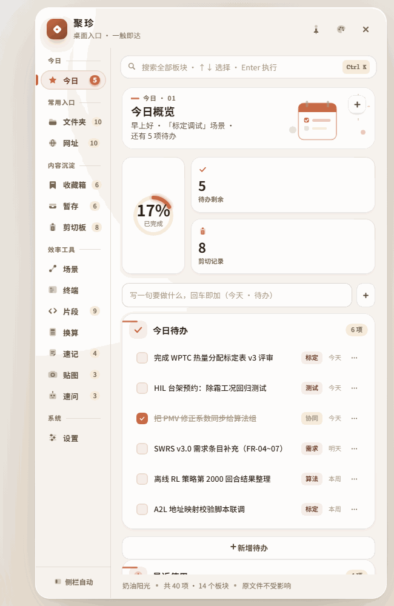
</p>
<p align="center"><sub>今日概览 —— 左边是桌面，右边是面板。待办、最近使用、场景，一屏看全</sub></p>

> **直接下载桌面版**（免安装、免 Node 环境）：
> [聚珍 v0.7.0 便携版 · Windows x64](https://github.com/suzike/juzhen-dock/releases/latest)
>
> 首次启动若被 SmartScreen 拦下，选「更多信息 → 仍要运行」。源码全部公开，可自行构建复核。

---

## 一、功能板块

主界面共 14 个板块，按用途分为 5 组：

| 分组 | 板块 | 说明 |
|---|---|---|
| **今日** | 今日概览 | 待办 · 最近 · 场景，一屏看全 |
| **常用入口** | 文件夹直达 | 按父目录自动归类，点击直达 |
| | 快捷网址 | 按用途自动归类 |
| **内容沉淀** | 收藏箱 | 粘贴链接，自动识别平台 |
| | 临时暂存 | 引用式记录，点击即预览 |
| | 剪切板 | 持久留存，自动分型 |
| **效率工具** | 场景切换 | 一次点击切换整组环境 |
| | 终端 | 真 ConPTY 会话，多标签 |
| | 片段与命令 | 可复制，带变量占位 |
| | 工程换算 | 单位换算 · 湿空气 · PMV |
| | 速记 | 想到就记，不打断思路 |
| | 贴图 | 截图或图片钉在桌面最上层 · 独立小窗，可拖、可缩、可调透明度 |
| | AI 速问 | 唤出即问，可一键存入速记 |
| **系统** | 设置 | 配色、触发方式与显示方式 |

### 文件与内容按用途自动归类

<p align="center">
  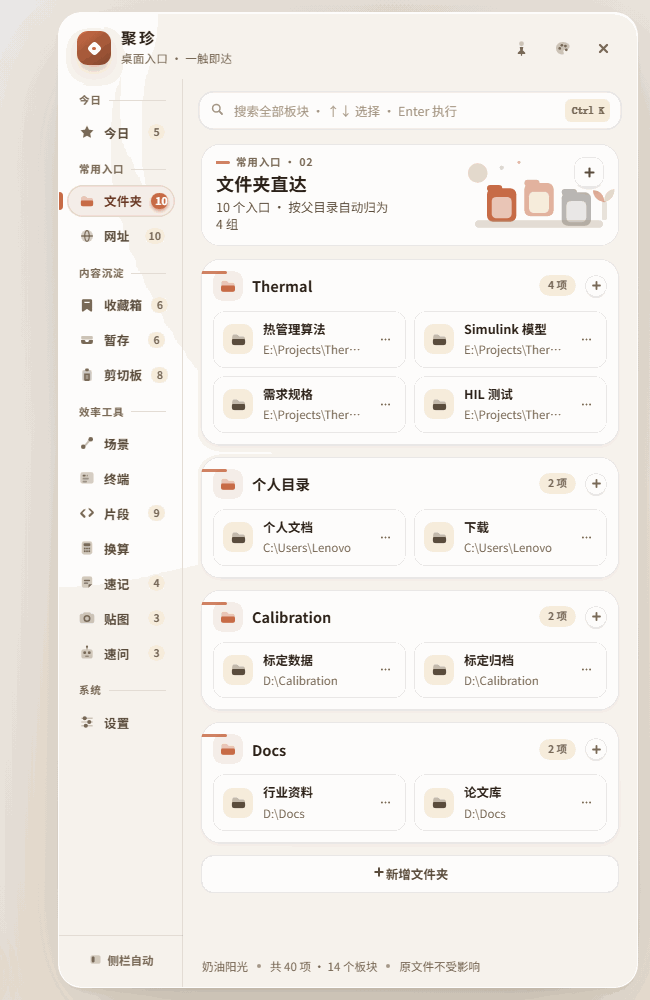
</p>

不用手工建分组：按父目录自动归类。每条右侧的 `⋯` 是**看得见**的编辑入口 ——
改文件名、删条目都不靠右键，右键菜单在这里一律做成常显按钮。

<p align="center">
  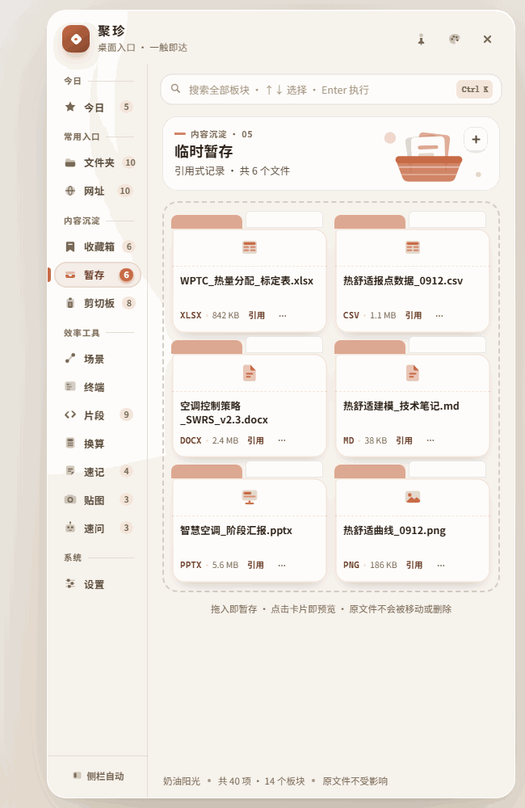
</p>

临时暂存走**引用式**记录：条目只存路径与摘要，点标题即预览，**原文件不受影响**。

### 工程换算按专业需求内置

<p align="center">
  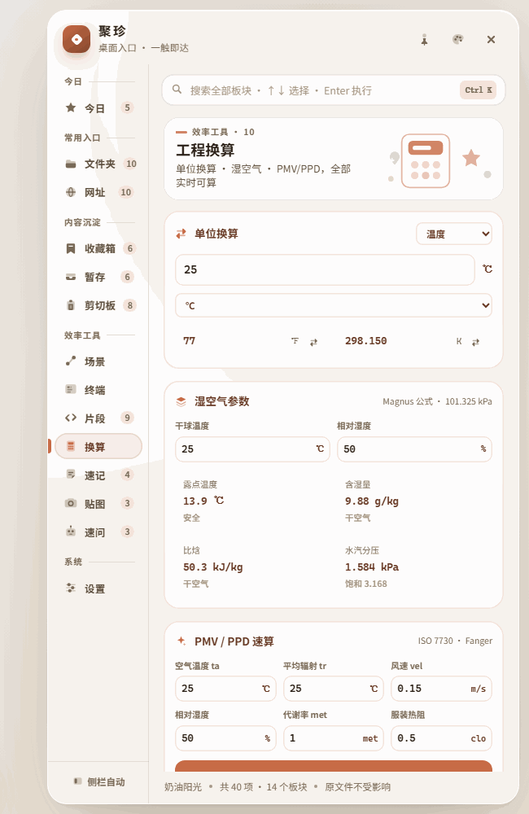
</p>

不是通用单位转换器：单位换算、湿空气、PMV 热舒适三块，按热管理与空调开发的实际口径做。

### 搜索是全局的

<p align="center">
  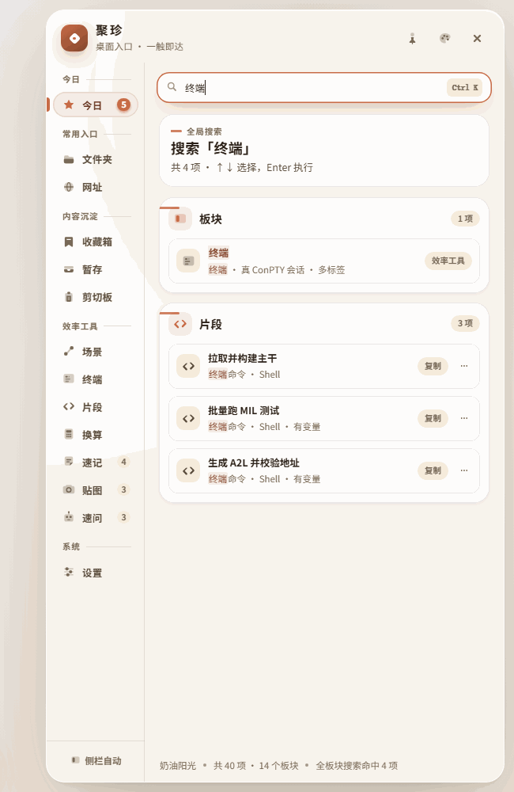
</p>

`Ctrl K` 唤出，一次跨全部 14 个板块检索 —— 板块本身、条目、片段、网址都在结果里。
新增板块只需在 `searchGroups()` 补一条来源，不用改动搜索界面。

### 贴图钉屏：截一张，钉一屏

`Win+Shift+S` 截图进剪切板，到贴图页点「钉住剪切板里的图」——图以独立的无边框
置顶小窗落在桌面右下，按住图面拖动、拖边角缩放、悬停出控制条调透明度；
也可以「选一张图片钉上」。收起面板、切去干别的，钉着的参考图都不走。

三条设计决定值得写下来：

- **图片一律先复制副本**（`userData/files`）：钉在桌面上的参考图，原件被挪走、
  删掉之后钉窗就瞎了。引用式省下的那点磁盘，换不来"钉得牢"。缩略图加载失败时
  当场换成「图片文件已不在」的占位，不摆一张永远裂开的图。
- **透明度只有一份事实来源**（面板记录里的 `op`）：面板滑杆和钉窗悬停滑杆
  改的是同一个数，另一头实时跟上的同时落档 —— 两根滑杆各改各的，
  下次钉回来透明度又变回去，用户只会觉得"这东西记不住"。
- **窗口几何不进存档**（记在 `userData/shots-pin.json`）：窗口摆位归窗口管，
  记录内容归存档管。退出聚珍时钉窗跟着关（窗口活不过进程，这是实话），
  记录、图片副本、上次摆位都在，下次一键钉回原位。

清空列表、删单条、恢复示例、导入存档都会做一次对账：失去记录可归的钉窗
**跟着收掉**，绝不留下几扇找不到主的窗让人挨个 Alt+F4。

---

## 二、终端

**真 ConPTY 会话，不是模拟终端。** 面板宽 580 px，终端占正文容器约 0.78 的高度。

<p align="center">
  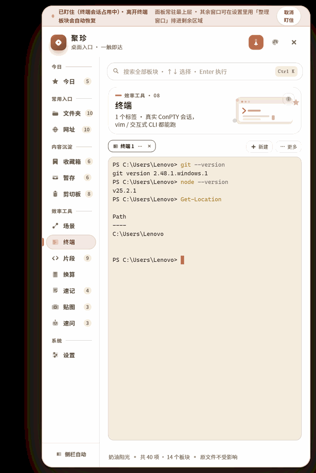
</p>

这个板块是「撤掉常驻、保住功能」这条准则的样板：原来堆在页面里的五层东西
（预设命令墙、状态条、四行静态说明、标签栏按钮）全撤了，只剩标签栏 + 终端本体。
撤掉的东西**一条没丢**，都收进了两个可见入口：

- **页头 ⓘ** —— 键位、会话生命周期、pwsh 依赖，写在这里
- **标签栏「更多」** —— 常用命令、复制、会话摘要、AI 诊断、交接记录

<p align="center">
  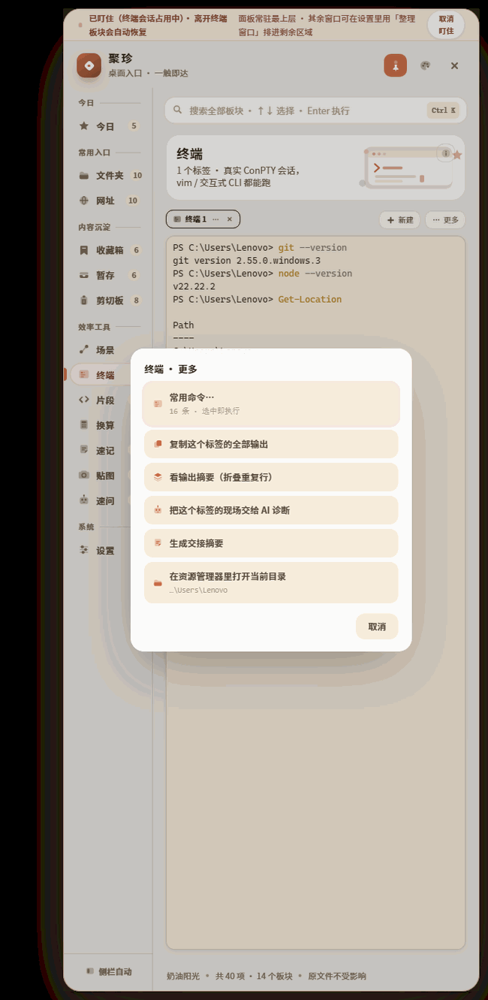
</p>

常用命令是二级浮层，**每条都带着它将要执行的命令原文** —— 要跑起来的东西，
用户有权在按下之前看见它到底要执行什么。墙上的按钮做不到这件事（只有悬停才有 title）。

---

## 三、窗口分区

**触发是一键整理，不自动动手。** 带「还原窗口」，绝不自动搬用户的窗口。

<p align="center">
  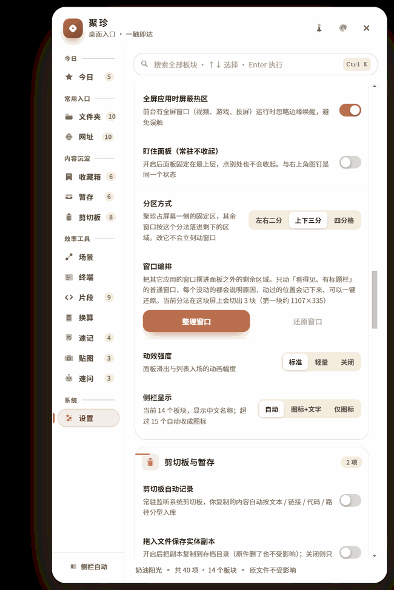
</p>

诚实设计写进了实现里，一条都没省：

- 只动「看得见 + 有标题 + 普通」的顶层窗口；
- **每一条跳过都带原因回到界面**，不静默忽略；
- 窗口多于分区时进 `extra` 列表，**不叠上去**；
- 成功后写 `zones-last.json`，才谈得上还原；
- 多屏按「光标所在屏」计算。

实现游走在纯 Node（矩形计算）与 PowerShell（`SetWindowPos` 摆位）之间：
中文窗口标题走 JSON 传递，不进脚本正文；判定用 **`JZJ:` 哨兵**定位返回值。
`Add-Type` 编译不出来时**带着原因失败**，绝不吐一个「整理好了，0 个窗口」。

---

## 四、AI 与知识库

**8 家对话服务商 + 5 家嵌入服务商**，各自独立配置地址与模型名。
换服务商时地址与模型名自动跟着换，**绝不复用 A 家的 Key 给 B 家**。

<p align="center">
  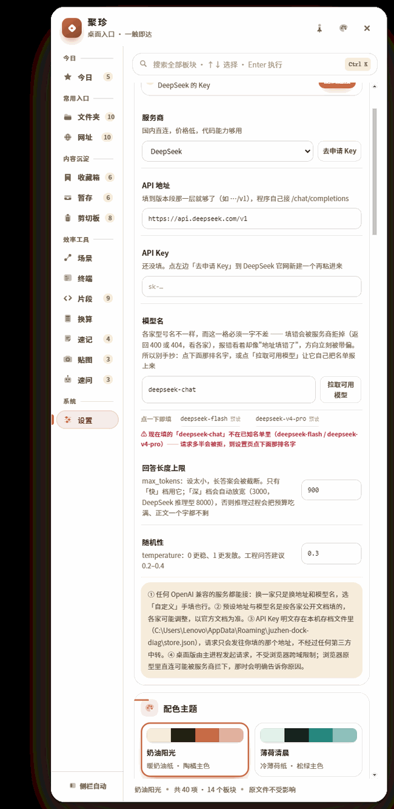
</p>

- **Key 存本机**：`settings.ai.keys[provider]`，明文存于本机 `localStorage`
  与 `userData`。不上传、不入库、不同步。
- **模型名带候选名单**：填的名字不在服务商自家名单里时，界面告警并允许点选 ——
  手抄的模型名会错，而且错得**像是网络问题**（这条是踩过坑之后加的）。
- **知识库诚实边界**：开启「只看知识库」时，若不可用 / 失败 / 无命中，
  **明确拒绝作答并说明原因**，绝不静默降级成模型自答；非该模式则声明
  「这条回答没接地」。
- 网页抓取**不执行 JavaScript**，抓不到就如实报错，不假装拿到了内容。

---

## 五、配色

十三套主题（含两套曜黑深色：曜夜·鸢尾紫、流萤·荧光绿），每套**只变三样东西**：一套纸面、一套墨色、**一个主色**。
主色只出现在小面积点缀处（选中项、图标底、分组标题前那道短色条），
其余一律走墨色深浅 —— 大面积铺色会「花」。

<p align="center">
  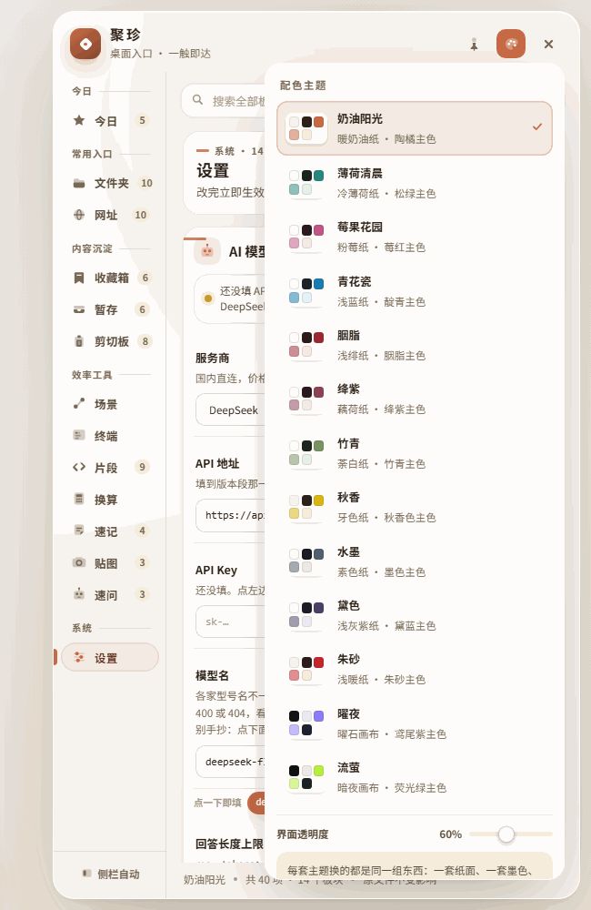
</p>

色块不是示意，是**实际渲染色**。同一页换一套主色（青花瓷）：

<p align="center">
  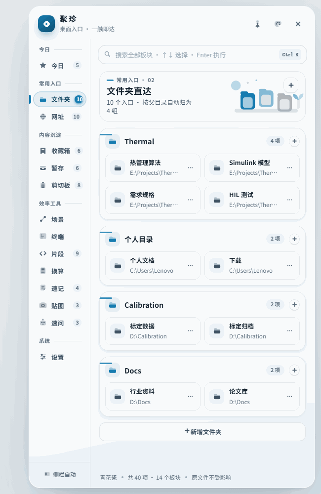
</p>

深色不是反色，是另一套画法：画布、面板、卡片三档逐档提亮，阴影换纯黑，
进度环带同色柔光——参照深色仪表盘的通行做法（[design-midnight.md](docs/design-midnight.md)）：

<p align="center">
  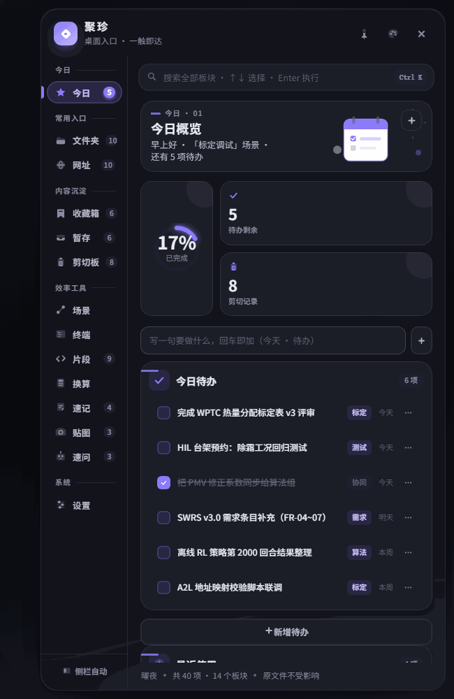
</p>

界面透明度是一根总控（30–100），推算出每一层的 alpha，而不是只改面板底色 ——
只改面板会让四层材质挤在一起。验收不看截图看算出来的 alpha 值：
30% 与 100% 的截图差别很淡，"看着差不多"可能真没生效。

---

## 六、架构

**整个项目只有一份 UI 源码，同时产出浏览器原型与 Electron 桌面版两种形态。**

<p align="center">
  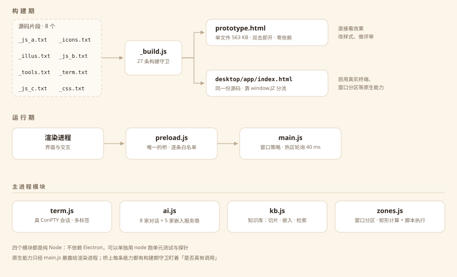
</p>

### 单文件构建流水线

`_build.js` 按固定顺序拼装源码片段，一次产出两个产物：

```
_js_a.txt  ─┐                     ┌─→ prototype.html        （浏览器原型）
_icons.txt ─┤                     │
_illus.txt ─┤                     │
_js_b.txt  ─┼─→ _build.js ────────┤
_tools.txt ─┤   （含 27 条守卫）   │
_term.txt  ─┤                     └─→ desktop/app/index.html （Electron 前端）
_js_c.txt  ─┘
_css.txt   ──→ 内联进以上两者
```

拆成 8 个片段的理由：`_js_c.txt` 是 270 KB 的巨型文件，整文件改动的评审成本过高。
拆开之后，改配色只碰 `_css.txt`，改终端只碰 `_term.txt`。

> **`_term.txt` 必须排在 `_js_c.txt` 之前** —— 后者末尾是启动序列。

### 桌面版与浏览器版的分流

```js
const DESK = !!(window.JZ && window.JZ.isDesktop);
```

同一份 `index.html`：浏览器里 `window.JZ` 不存在 → 纯前端模式；
Electron 里 `preload.js` 注入 `window.JZ` → 启用真实终端、窗口分区等原生能力。
**不维护两份 UI。**

### Electron 侧模块

| 文件 | 职责 |
|---|---|
| `main.js` | 主进程：窗口策略、热区轮询、贴图钉窗、自检（`JZ_DIAG=1`） |
| `preload.js` | 唯一的渲染进程 ↔ 主进程桥（逐条白名单，不暴露 `ipcRenderer`） |
| `term.js` | ConPTY 终端会话管理 |
| `ai.js` | AI 服务商适配（8 家对话 + 5 家嵌入） |
| `kb.js` | 知识库：切片、嵌入、检索（RAG） |
| `zones.js` | 窗口分区：矩形计算 + PowerShell 执行 |

**窗口策略**：不是全屏透明穿透窗口，而是收起时 `win.hide()`、展开只覆盖右侧 680 px。
热区判定靠主进程以 40 ms 轮询 `screen.getCursorScreenPoint()`（因此不依赖任何原生模块），
判定逻辑抽成纯函数以便喂坐标自检 —— **自检不会真去移动用户的鼠标。**

### 两种形态怎么选

```
juzhen-dock/prototype.html     # 单文件 563 KB、双击即开、零依赖
juzhen-dock/desktop/           # Electron 桌面版
```

```bash
cd juzhen-dock/desktop
npm install
npm start                 # 开发运行

npm run pack              # 打包便携版 exe → dist/聚珍-<版本>-便携版.exe
```

> `.npmrc` 已配置 npmmirror 镜像，国内网络可直接安装。

浏览器原型里桌面版专有的能力（真实终端、窗口分区、贴图钉屏）不会渲染 ——
这是设计，不是缺陷。

---

## 七、验证体系

这个项目的验证不靠"看着没问题"，靠**可执行判据**。

### 1. 构建期守卫（27 条）

`node _build.js` 结束时打印一行总账：

```
守卫总账: 全绿（27 条）
```

守卫覆盖的范围（每一条都是谓词，不是字符串猜谜）：

- 语法、函数白名单、`data-act` / `data-kind` 孤条目
- **桥上每个能力必须 ≥1 处真实调用** —— 能跑通 ≠ 接线了
- **跨文件字段名契约**（界面发 `{provider,baseUrl,model,apiKey}`，`ai.js` 必须读得出）
- **退役函数名**：删函数必须连调用点一起删，名字进 `RETIRED` 表后
  在**剥掉注释**的代码里再出现就报红
- 打包白名单、终端依赖登记、主题色阶补齐

> **守卫写完必须反向验证一次**：故意改坏 → 确认报红 → 还原。
> 不能失败的守卫只是装饰。

### 2. 走查探针

以无头 Chrome 真实走查产物，逐条断言，按板块分文件：

```
_probe10.js   页头版式（13 页文字不被插画遮挡）
_probe23.js   可见入口审计
_probe28.js   主题与 WCAG 对比度
_probe29.js   终端页（116 项）
_probe32.js   透明度（按 alpha 断言，不看截图）
```

**验收读数字，不读截图** —— 30% 与 100% 透明度的截图差别很淡，
"看着差不多"可能真没生效。

### 3. 模块级单元测试（纯 Node，不依赖 Electron）

```bash
node _aitest.js      # AI 服务商适配
node _llmtest.js     # 错误映射（401/402/404/429）
node _kbtest.js      # 知识库检索
node _termtest.js    # 终端
node _pmvtest.js     # PMV 热舒适模型
node _zonetest.js    # 窗口分区矩形计算
node _zonerun.js     # 窗口分区真跑一次脚本
```

### 4. Electron 端自检

```bash
JZ_DIAG=1 electron desktop --disable-gpu --disable-software-rasterizer --no-sandbox
```

逐页截图 + 结构化报告，写到 `userData/juzhen-dock-diag/_deskcheck.txt`。

> `--no-sandbox` 是承重参数：漏掉会导致 GPU 进程反复崩溃、以 exit 3 退出，
> 且**自检报告只写下第一行就没了**，症状与"抢不到单实例锁"完全一样。

### 十轮设计演进（2026-09-27）

对着 GitHub 高星组件库（shadcn/ui / MUI / Ant Design / Open Props / Arco / Semi / TDesign）
做了一轮系统性的设计借鉴，落地为 10 轮优化与增强，每轮由独立审查 agent 按可执行判据验收：
设计令牌体系（260 处收编）→ 数字排版 → 动效系统（补齐 reduced-motion 覆盖缺口）→
状态设计（空态/骨架/禁用/徽标）→ 搜索体验（高亮/历史/修眉标 bug）→ 今日进度环 →
换算器 14 组单位与全精度复制回填 → 片段收藏与速记筛选 → 主题 9→11 套 + 夜间自动水墨 →
键盘与读屏可达。过程中抓出并修复一个加载即崩的 TDZ 缺陷（静态守卫抓不到，
由此新增运行时冒烟探针 `_probe34.js`）。台账见 [docs/design-rounds.md](docs/design-rounds.md)，
调研笔记见 [docs/design-research.md](docs/design-research.md)。

---

## 八、已知边界

以下项目**当前未实现**，界面以灰标签标注现状，不留"点得动、点了没反应"的开关：

| 项目 | 现状 |
|---|---|
| 文件内容解析 | 能打开、能定位，**不按扩展名解析内容** |
| 「最近使用」条目 | 只能移除，不能改名 |
| 窗口分区摆位 | 分区矩形计算与脚本执行已测；`SetWindowPos` 实际搬动窗口需人工点一次确认 |
| 贴图钉屏 · 截图方式 | 钉的是"剪切板里已有的图"（Win+Shift+S 之后都在）或选中的图片文件；**面板内自己划框截图**没有做，也没有做的必要 —— 系统截图工具已经很好用 |
| 贴图钉屏 · 跨启动 | 退出聚珍钉窗跟着关；记录、副本、摆位都在，重开面板一键钉回，**不自动恢复** |

另外两条**测量工具本身的局限**（不是产品缺陷，写在这里免得下一个人误判）：

- Electron `capturePage` 偶尔抓不到 xterm 那一层 —— **不要用截图判断终端有没有画出来**，
  判据是 `.xterm-rows` 的 `textContent`。
- 窗口隐藏时 Chromium 会暂停 `requestAnimationFrame`，xterm 的 `fit()` 不跑、
  不重绘 —— 这是"没机会画"，不是"画不出来"。

---

## 九、目录结构

```
.
├── README.md
├── docs/
│   ├── architecture.svg       # 架构图（矢量，可用浏览器打开）
│   └── screenshots/           # 本文所有截图
├── juzhen-dock/
│   ├── _build.js              # 构建 + 27 条守卫
│   ├── _js_a.txt              # ┐
│   ├── _icons.txt             # │
│   ├── _illus.txt             # │
│   ├── _js_b.txt              # ├ 8 个源码片段
│   ├── _tools.txt             # │
│   ├── _term.txt              # │
│   ├── _js_c.txt              # ┘（270 KB，必须最后拼）
│   ├── _css.txt               # 样式（内联进产物）
│   ├── prototype.html         # ★ 构建产物 · 浏览器原型，双击即开
│   ├── _shots21.js            # README 配图的拍摄脚本
│   ├── _shotscut.py           # 配图的裁切与压缩
│   ├── _probe*.js             # 走查探针
│   ├── _zonetest.js           # 窗口分区：矩形计算
│   ├── _zonerun.js            # 窗口分区：真跑一次脚本
│   ├── _*test.js              # 模块级单元测试
│   └── desktop/               # ★ Electron 桌面版
│       ├── main.js            #   主进程
│       ├── preload.js         #   桥（逐条白名单）
│       ├── term.js            #   ConPTY 终端
│       ├── ai.js              #   AI 服务商适配
│       ├── kb.js              #   知识库 RAG
│       ├── zones.js           #   窗口分区
│       ├── app/index.html     # ★ 构建产物 · 桌面版前端
│       ├── app/pin.html       #   贴图钉窗页面（纯静态，与面板共用 preload）
│       └── app/vendor/        #   xterm.js
└── _ref/
    └── agentic-island/        # 设计参考（git submodule）
```

> 克隆后若要取得设计参考代码：
> ```bash
> git submodule update --init --recursive
> ```

### 本文配图怎么来的

截图**不是另画的示意图**，是脚本从产物本身拍的 —— 示意图会跟真身走散。

```bash
cd juzhen-dock
node _shots21.js                               # 无头 Chrome 逐页拍浏览器原型
python _shotscut.py                            # 裁掉面板外的留白 + 调色板量化
```

桌面版专有的页面（终端、窗口分区）浏览器里拍不出来，取自 Electron 自检的落盘截图。
`_shots21.js` 冻结了入场动效再拍，否则每张图截在动画的不同帧上，元素位置对不齐。

---

## 十、许可

MIT，见 [LICENSE](LICENSE)。
